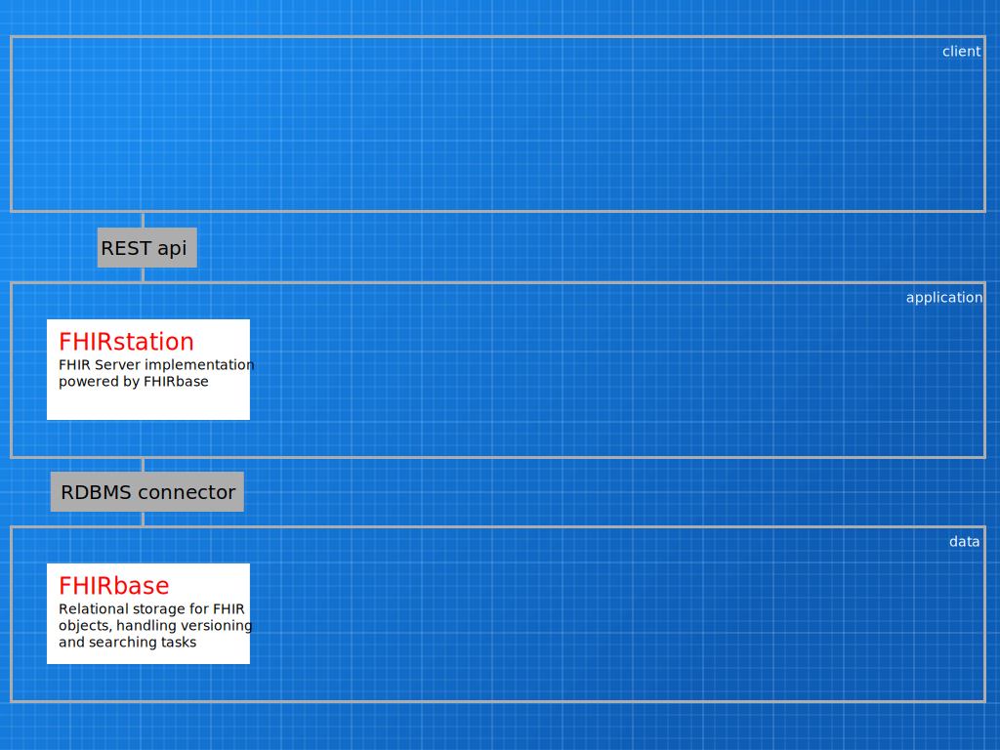

# FHIRstation
**Summary:** FHIR server django app built on top of FHIRbase

**Key objectives:**

* Provide a working, documented, FHIR API interface
* Meet the HL7 FHIR [Implementer's Safety Checklist](http://hl7.org/implement/standards/fhir/implementation.html#Use)
* Support server side django application development by providing the relevant FHIR objects as python/django classes
* Keep technology stack to the minimal technologies identified in Diakonia (python/postgres) to aide maintenance, development, and system administration
* Be as [pythonic](https://en.wikipedia.org/wiki/Zen_of_Python) as possible. [Zen is good](https://www.python.org/dev/peps/pep-0020/)

## Notes
Background research for alternative solutions:

* [List of open source FHIR implementations](http://wiki.hl7.org/index.php?title=Open_Source_FHIR_implementations) contains 4 examples: One in [Delphi/MSSQL](https://github.com/grahamegrieve/fhirserver); One in Grails (Java/Groovy/Postgres); One in [.net/MongoDB](https://github.com/furore-fhir/spark); One in Java/java-db. None of these fit the technology stack requirements
* [GNU Health](https://en.wikibooks.org/wiki/GNU_Health) offers a FHIR server in [python/tryton/postgres](https://en.wikibooks.org/wiki/GNU_Health/Installation) stack, so may offer some help, but isn't close enough to the mark to start from
 * The Tryton based server code is at [http://hg.savannah.gnu.org/hgweb/health/file/9e52df027d5d/tryton/backend/fhir/server](). Not clear at first glance as to its operation and how/why the fhir classes are hardcoded
 * The basic [python client](https://pypi.python.org/pypi/fhir) from them is also not maintained... (last uploaded 17/4/2014)
* SMART on FHIR offers a maintained [python FHIR client](https://github.com/smart-on-fhir/client-py) with [good documentation](https://smart-on-fhir.github.io/client-py). This may be able to be incorportated to provide the FHIR objects as python classes, however this is written as a flask app, so can't be fully run without expanding the tech base with another python framework
 * Perhaps of more use is the SMART on FHIR, [fhir-parser](https://github.com/smart-on-fhir/fhir-parser) which goes through the specification and generates python classes
 * They also have a [package of sample patients](https://github.com/smart-on-fhir/sample-patients) for testing with
* [Django-FHIR](https://github.com/videntity/django-fhir) (nice optimistic title) is an alpha level project that hasn't seen development in 5+ months which aims to do python/django/mongodb implementation of a FHIR server. Alpha level is a bit of a stretch from browsing through the current master branch, looks like there isn't much to work from here

## Design
This is the nitty gritty bit... what **is** a FHIR Server? How much functionality can we hand off to FHIRbase? Are there packages (like [Django REST Framework](http://www.django-rest-framework.org)) we can hand off large chunks of functionality to? 

[http://try-fhirplace.hospital-systems.com/fhirbase-presentation/index.html#/]() -- Handy layer cake diagram as a guide for what we're trying to do here (client/application/data).

FHIRbase have [taken the view that](http://try-fhirplace.hospital-systems.com/fhirbase-presentation/index.html#/fhirbase) json is the standard for web apis, and so don't export xml natively. They do offer an xslt transformation for [FHIR xml to json](https://github.com/fhirbase/fhir-xml2json), which is handy, but nothing vice-versa. Whilst it recommends using Saxon as the XSLT engine, [lxml](http://lxml.de) is [a more common](http://stackoverflow.com/questions/16698935/how-to-transform-an-xml-file-using-xslt-in-python) python approach. There is a [JS implementation that does json to xml](https://github.com/kwboone/FHIR-JSON-to-XML-Converter) to look at. **Consider:** Leaving XML implementation to a later version of FHIRstation.

